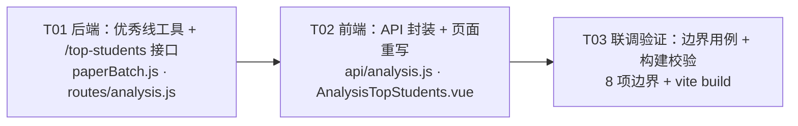
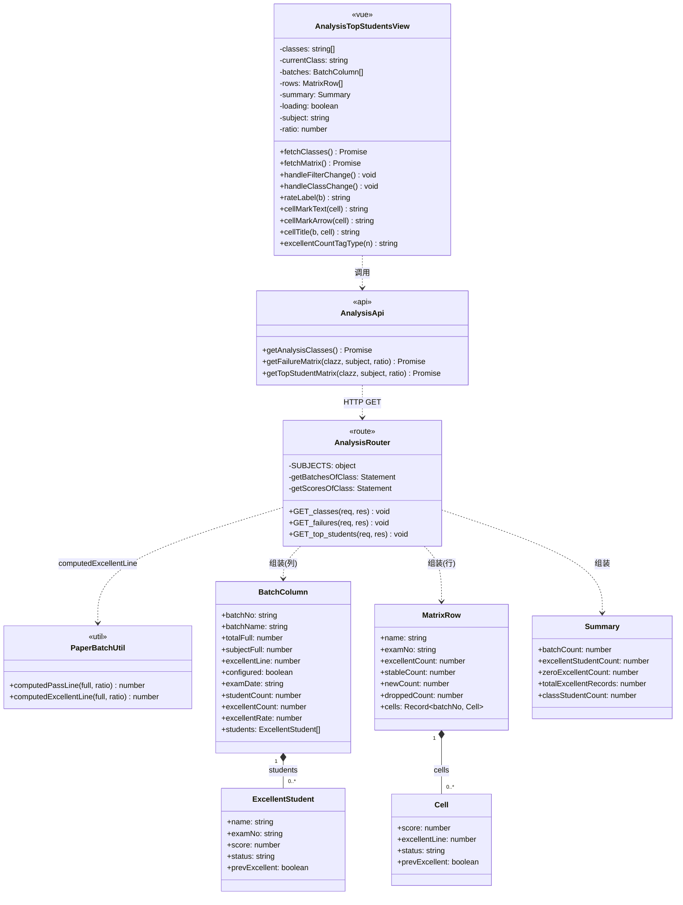
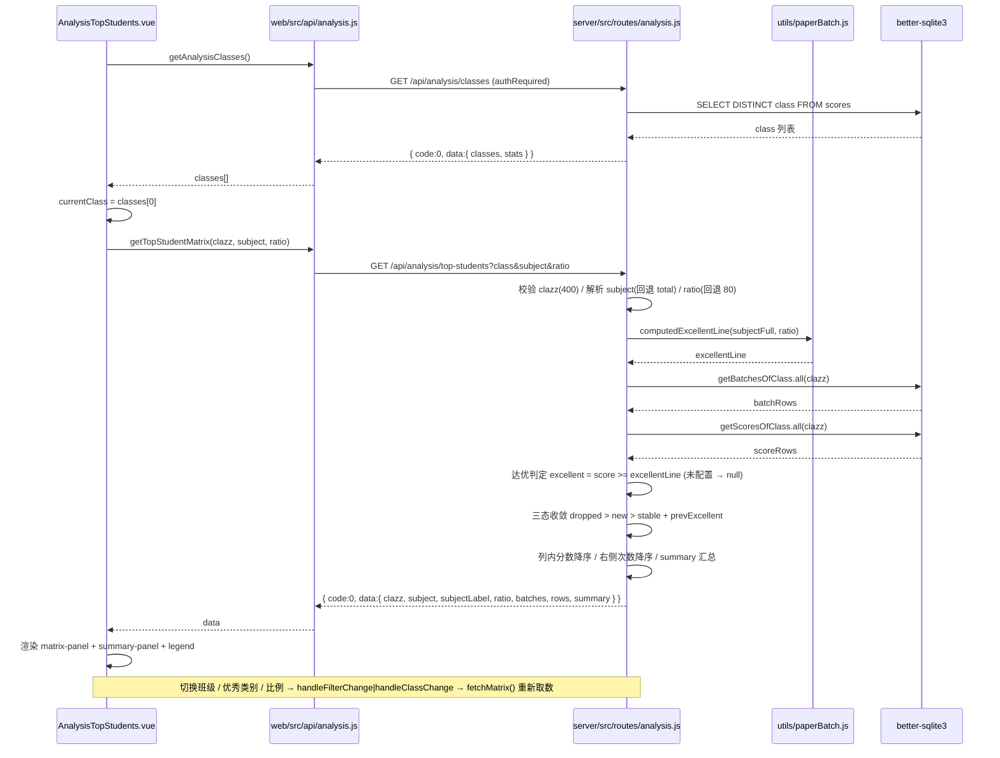

# 优生管理页 · 增量架构设计 + 任务分解

> 文档性质：增量架构设计（基于已定稿 PRD：`docs/prd-top-students.md`）
> 作者：高见远（架构师） ｜ 交付对象：寇豆码（工程师）
> 基线页：`web/src/views/analysis/AnalysisFailures.vue`（505 行，逐段镜像）
> 技术栈：沿用现有（Vue 3 `<script setup>` + Vite + Element Plus；Express + better-sqlite3 + JWT）
> 设计铁律：① **最小侵入** —— 不新增依赖、不改表、不动 `index.js` / `router/index.js`；② **零硬编码** —— 班级名、批次名、满分、优秀线、优秀率、科目名全部来自接口，前端常量仅保留下拉可选项；③ **与 `/failures` 严格对称** —— 字段命名同构、判定方向相反。

---

## 一、实现方案与选型

### 1.1 难点与对策

| # | 难点 | 对策 |
| --- | --- | --- |
| D1 | 新页必须与基线页「像素级同构」，但判定方向相反（`< 及格线` → `≥ 优秀线`） | 页面以基线页为模板逐段迁移（`header-row` / `board-wrap` / `matrix-panel` / `summary-panel` / `legend` / `el-empty`），**只替换数据源与方法名**，样式类名字典式复用；后端路由以 `/failures` 为蓝本复制改写 |
| D2 | 优秀线若复用 `computedPassLine` 会造成「及格线/优秀线」语义混淆 | 新增**独立命名**纯函数 `computedExcellentLine(full, ratio)`，公式相同、语义独立（PRD P0-2） |
| D3 | 优秀比例是用户当次选择，不能污染 `paper_batches.pass_ratio` | 比例只作为 **query 参数**参与运行时计算，**不读 `pass_ratio`、不写表、不加列** |
| D4 | 单元格 110px 只能放一个箭头，但三态可能叠加（首次达优 + 后续掉出） | 后端按 `dropped > new > stable` 收敛为单 `status`；额外返回布尔 `prevExcellent`，前端仅在 `title` 中补全次要状态 |
| D5 | 「无人达优」时不能出现空白页 | 后端 `rows` 始终包含全班学生（`excellentCount = 0` 也返回）；前端 `el-empty` 的 `v-if` 与基线页**逐字一致**（只在无班级 / 无批次时触发） |
| D6 | 单科口径下某批次该科满分未配置（=0） | 该批次 `configured = false`：不判达优、不判未达优、不参与三态、优秀率 0%、表头省略「（满分）」 |

### 1.2 选型说明（为何不引入任何新依赖）

| 候选能力 | 结论 | 理由 |
| --- | --- | --- |
| 图表（趋势线） | **不引入** | 三态用文字箭头承载；P2-2 迷你趋势本期不做 |
| 日期处理（dayjs） | **不引入** | 复用基线页 `formatShortDate()` 正则实现（12 行，零依赖） |
| 排序 / 分组（lodash） | **不引入** | 仅有 `Array.sort` + `localeCompare(zh-Hans-CN)`，与基线页一致 |
| 状态管理（Pinia） | **不引入到本页** | 页面级局部状态即可，与基线页一致（`ref` / `computed`） |
| 新增 npm 包 | **无** | 本次改动 100% 落在既有能力范围内（Express 路由 / better-sqlite3 预编译语句 / Element Plus 组件与图标） |

> 结论：**依赖包新增 = 0**（详见 §七）。

### 1.3 架构分层

```
┌──────────────────────────────────────────────────────────────┐
│ 视图层  web/src/views/analysis/AnalysisTopStudents.vue        │  重写（镜像 AnalysisFailures.vue）
├──────────────────────────────────────────────────────────────┤
│ 接口层  web/src/api/analysis.js                               │  +1 方法 getTopStudentMatrix
├──────────────────────────────────────────────────────────────┤
│ 路由层  server/src/routes/analysis.js → GET /top-students      │  +1 路由（复用 /failures 全部基础设施）
├──────────────────────────────────────────────────────────────┤
│ 工具层  server/src/utils/paperBatch.js                        │  +1 纯函数 computedExcellentLine
├──────────────────────────────────────────────────────────────┤
│ 数据层  scores / paper_batches（**结构零变更**）                │  只读
└──────────────────────────────────────────────────────────────┘
```

**与 `/failures` 复用的既有资产（不重写、不复制）**：`getBatchesOfClass`、`getScoresOfClass` 两条预编译语句、`SUBJECTS` 映射、`compareClass`、批次时间序排序 + `orderOf` 序号映射、`authRequired` 中间件。

---

## 二、文件清单

| # | 相对路径 | 性质 | 改动要点 |
| --- | --- | --- | --- |
| F1 | `server/src/utils/paperBatch.js` | **修改**（+1 函数 +1 导出） | 新增 `computedExcellentLine(full, ratio)`（同名不同义独立命名）；`module.exports` 追加导出 |
| F2 | `server/src/routes/analysis.js` | **修改**（+1 路由，约 110 行） | 顶部 `require` 追加 `computedExcellentLine`；文件末尾 `module.exports` 之前新增 `GET /top-students`；**不改动** `/classes` 与 `/failures` 一行 |
| F3 | `web/src/api/analysis.js` | **修改**（+1 方法） | 新增 `getTopStudentMatrix(clazz, subject = 'total', ratio = 80)` |
| F4 | `web/src/views/analysis/AnalysisTopStudents.vue` | **重写**（占位页 → 完整页，约 500 行） | 移除 `el-card #header` 占位结构，改为内联 `.header-row`；模板 / 脚本 / 样式逐段镜像基线页；配色新增蓝色档 |
| — | `server/src/index.js` | **不改** | `/api/analysis` 已挂载（第 27 行），新路由自动生效 |
| — | `web/src/router/index.js` | **不改** | `/analysis/top-students` 子路由已存在（第 34-38 行） |
| — | `server/src/db.js` | **不改** | 不改表、不加列、不加迁移 |
| — | `web/src/views/analysis/AnalysisFailures.vue` | **不改** | 基线页保持只读参照，禁止顺手重构 |

> 实际编码改动 **4 个文件**（核心逻辑文件 3 个 + 1 个纯函数文件）。

---

## 三、接口规格

### 3.1 `GET /api/analysis/top-students`

| 项 | 值 |
| --- | --- |
| 路径 | `/api/analysis/top-students`（由 `server/src/index.js` 第 27 行挂载到 `/api/analysis`） |
| 鉴权 | `authRequired`（与 `/failures` 完全一致） |
| Query | `class`（**必填**，空 → `400 {code:400,message:'班级参数不能为空'}`）；`subject`（默认 `total`，非法 → 回退 `total`）；`ratio`（默认 `80`，非数字 / ≤0 / >100 → 回退 `80`） |
| 判定 | `得分 ≥ ROUND(该科满分 × ratio / 100, 2)` = 达优；该科满分 ≤ 0 → 跳过判定 |
| 响应 | `{ code: 0, data: { clazz, subject, subjectLabel, ratio, batches[], rows[], summary{} } }` |

### 3.2 完整响应 JSON（示例）

```json
{
  "code": 0,
  "data": {
    "clazz": "高一5班",
    "subject": "total",
    "subjectLabel": "总成绩",
    "ratio": 80,
    "batches": [
      {
        "batchNo": "2025A01",
        "batchName": "第一次月考",
        "totalFull": 100,
        "subjectFull": 100,
        "excellentLine": 80,
        "configured": true,
        "examDate": "2025-09-01",
        "studentCount": 31,
        "excellentCount": 8,
        "excellentRate": 25.81,
        "students": [
          { "name": "张三", "examNo": "20250001", "score": 98, "status": "new",       "prevExcellent": false },
          { "name": "李四", "examNo": "20250002", "score": 92, "status": "stable",    "prevExcellent": true  },
          { "name": "王五", "examNo": "20250003", "score": 80, "status": "dropped",   "prevExcellent": false }
        ]
      },
      {
        "batchNo": "2025A02",
        "batchName": "期中考试（该科未配置满分）",
        "totalFull": 0,
        "subjectFull": 0,
        "excellentLine": 0,
        "configured": false,
        "examDate": "2025-10-12",
        "studentCount": 30,
        "excellentCount": 0,
        "excellentRate": 0,
        "students": []
      }
    ],
    "rows": [
      {
        "name": "李四",
        "examNo": "20250002",
        "excellentCount": 3,
        "stableCount": 2,
        "newCount": 1,
        "droppedCount": 0,
        "cells": {
          "2025A01": { "score": 92, "excellentLine": 80, "status": "stable", "prevExcellent": true },
          "2025A03": { "score": 95, "excellentLine": 80, "status": "stable", "prevExcellent": true },
          "2025A04": { "score": 88, "excellentLine": 80, "status": "stable", "prevExcellent": true }
        }
      },
      {
        "name": "王五",
        "examNo": "20250003",
        "excellentCount": 1,
        "stableCount": 0,
        "newCount": 0,
        "droppedCount": 1,
        "cells": {
          "2025A01": { "score": 80, "excellentLine": 80, "status": "dropped", "prevExcellent": false }
        }
      },
      {
        "name": "赵六",
        "examNo": "20250006",
        "excellentCount": 0,
        "stableCount": 0,
        "newCount": 0,
        "droppedCount": 0,
        "cells": {}
      }
    ],
    "summary": {
      "batchCount": 4,
      "excellentStudentCount": 9,
      "zeroExcellentCount": 22,
      "totalExcellentRecords": 20,
      "classStudentCount": 31
    }
  }
}
```

### 3.3 字段对照表（与 `/failures` 对称）

| `/failures` 字段 | `/top-students` 字段 | 类型 | 说明 |
| --- | --- | --- | --- |
| `passLine` | `excellentLine` | number | `ROUND(subjectFull × ratio / 100, 2)`，运行时计算 |
| `configured` | `configured` | boolean | 当前口径满分 > 0 |
| `failCount` | `excellentCount` | number | 该批次达优人数 / 该生达优次数 |
| `failRate` | `excellentRate` | number | `excellentCount / studentCount`，保留 2 位小数 |
| `failStudentCount` | `excellentStudentCount` | number | 达优 ≥1 次的人数 |
| `zeroFailCount` | `zeroExcellentCount` | number | 从未达优的人数 |
| `totalFailRecords` | `totalExcellentRecords` | number | 达优记录总条数 |
| `status: fail\|corrected\|laterPass` | `status: stable\|new\|dropped` | string | 三态（不读订正分） |
| `correctionScore` | `prevExcellent` | boolean | **扩展字段**：该批次之前是否已达优，仅用于 `title` 补全次要状态 |
| `correctedCount/laterPassCount/pendingCount` | `stableCount/newCount/droppedCount` | number | 同类计数（P1，便于调试与后续扩展） |

### 3.4 边界行为矩阵

| 场景 | 后端行为 |
| --- | --- |
| B1 无班级数据 | `/classes` 返回 `classes: []`，前端不调用本接口 |
| B2 该班无批次 | `batches: []`、`rows: []`、`summary` 全 0；前端显示 `el-empty` |
| B3 有批次无人达优 | `batches[].students = []`、`rows` 仍返回全班（`excellentCount: 0`）；**不触发空状态** |
| B4 某批次该科满分 ≤ 0 | `configured: false`、`excellentLine: 0`、`students: []`、`excellentRate: 0`；该批次记录 `excellent = null`，不参与三态 |
| B5 `subject` 非法 | 回退 `total`，响应回显 `subject: "total"` |
| B6 `ratio` 非法 | 回退 `80`，响应回显 `ratio: 80` |
| B7 `class` 缺失 | `400 { code: 400, message: '班级参数不能为空' }` |
| B8 同名学生 | 按 `name` 归集（`examNo` 取首个非空值），与基线页一致 |

---

## 四、判定与三态算法

### 4.1 优秀线（F1）

```js
/**
 * 计算优秀线（运行时，不落库）：ROUND(full × ratio / 100, 2)
 * 与 computedPassLine 同公式、独立命名：优秀线语义 ≠ 及格线，避免误用。
 * ratio 为用户当次查询选择（80/85/90），与 paper_batches.pass_ratio 无关。
 */
function computedExcellentLine(full, ratio) {
  const f = Number(full) || 0;
  const r = Number(ratio) || 0;
  return Math.round((f * r) / 100 * 100) / 100;
}
// module.exports = { ensurePaperBatch, computedPassLine, computedExcellentLine, deriveCreatedAt };
```

### 4.2 达优判定与三态（伪代码）

```
INPUT : clazz, subject, ratio
OUTPUT: batches[], rows[], summary{}

1  subj  = SUBJECTS[subject] || SUBJECTS.total          # 非法 → 回退 total
   ratio = (isFinite(ratio) && 0 < ratio <= 100) ? ratio : 80

2  batches = getBatchesOfClass(clazz).map(b => {
        subjectFull   = Number(b[subj.fullKey]) || 0
        excellentLine = computedExcellentLine(subjectFull, ratio)
        configured    = subjectFull > 0
        examDate      = b.createdAt || b.firstDate || ''
        studentCount  = b.studentCount
        _sortDate     = b.createdAt || b.firstDate || '9999-12-31'
     }).sort(日期升序 → 批号兜底)        # 与 /failures 完全同序
   orderOf: batchNo → 时间序下标           # 三态判定的唯一时间基准

3  byStudent = {}
   for r in getScoresOfClass(clazz):
       idx = orderOf[r.batchNo]; if idx == undefined: continue
       stu = byStudent[r.name] ||= { name, examNo, records: [] }
       cfg = batchMap[r.batchNo]
       score = Number(r[subj.scoreKey]) || 0
       stu.records.push({
           order: idx, batchNo: r.batchNo, score,
           excellentLine: cfg?.excellentLine ?? 0,
           configured:    cfg?.configured ?? false,
           # 三态基础判定：true=达优 / false=未达优 / null=该批次未配置，跳过
           excellent: (cfg && cfg.configured) ? (score >= cfg.excellentLine) : null
       })

4  for stu in byStudent:
       excellentRecords = stu.records.filter(r => r.configured && r.excellent === true)
       cells = {}; stableCount = newCount = droppedCount = 0
       for r in excellentRecords:
           prevExcellent = some(o in stu.records : o.order <  r.order && o.excellent === true)
           laterDropped  = some(o in stu.records : o.order >  r.order && o.excellent === false)
           if      laterDropped  : status = 'dropped'; droppedCount++   # 优先级 1（干预信号）
           else if !prevExcellent: status = 'new';     newCount++       # 优先级 2
           else                  : status = 'stable';  stableCount++    # 优先级 3
           cells[r.batchNo] = { score: r.score, excellentLine: r.excellentLine,
                                status, prevExcellent }
       rows.push({ name, examNo, excellentCount: excellentRecords.length,
                   stableCount, newCount, droppedCount, cells })
   rows.sort(优秀次数降序 → 姓名 localeCompare('zh-Hans-CN') 升序)   # 0 次自然沉底

5  excellentStudentCount = rows.filter(r => r.excellentCount > 0).length
   zeroExcellentCount    = rows.length - excellentStudentCount
   totalExcellentRecords = sum(rows.excellentCount)
   classStudentCount     = |{ r.name }|   # 成绩行按姓名去重

6  for b in batches:
       b.students = rows.map(r => r.cells[b.batchNo])
                        .filter(Boolean)
                        .map(c => { name, examNo, score, status, prevExcellent })
       b.students.sort(分数降序 → 姓名升序)          # 与 /failures 的升序严格相反
       b.excellentCount = b.students.length
       b.excellentRate  = studentCount > 0 ? ROUND(excellentCount / studentCount × 100, 2) : 0
       delete b._sortDate
```

### 4.3 三态真值表

| `prevExcellent`（更早有达优） | `laterDropped`（更晚有未达优） | 收敛 `status` | `title` 补充 |
| --- | --- | --- | --- |
| false | true | `dropped` ↓ | `，首次达优` |
| true | true | `dropped` ↓ | `，此前已持续优秀` |
| false | false | `new` ↗ | — |
| true | false | `stable` ✓ | — |

> **口径注记**：本设计采用团队定稿口径 —— `dropped = 该生更晚批次中存在未达优记录`。
> PRD §5.5 表格中「更晚批次中再无达优记录」的写法与其同节「该批次为最后一批次时不产生 `dropped`」的说明互斥；定稿口径与后者自洽（最后一批次无更晚记录 → 必不 `dropped`），故以定稿口径为准。

### 4.4 关键实现约束

1. `laterDropped` 只统计 `excellent === false` 的记录 —— `excellent === null`（未配置批次）**不参与**，避免把「未开考该科」误判为掉出。
2. `prevExcellent` 只统计 `excellent === true` 的记录 —— 更早批次未配置时不影响「是否首次」。
3. 唯一批次 / 最后一批次：无更晚记录 → `laterDropped = false` → 只可能是 `new` 或 `stable`。
4. **全程不读 `correction_*` 系列字段**（订正分语义属于不及格场景）；`getScoresOfClass` 已 SELECT 的 `correctionScore` 在本路由中**不消费**。

---

## 五、前端组件规格（`AnalysisTopStudents.vue`）

### 5.1 模板结构（与基线页逐节点对照）

```vue
<template>
  <div>
    <el-card class="page-card" shadow="never">
      <!-- ① 标题 + 判定条件 + 班级按钮组 -->
      <div class="header-row">
        <div class="page-title">
          <el-icon><Medal /></el-icon>
          <span>优生管理</span>
        </div>
        <div class="filter-group">
          <el-select v-model="subject" class="filter-select" @change="handleFilterChange">
            <el-option v-for="s in SUBJECT_OPTIONS" :key="s.value"
                       :label="`优秀类别：${s.label}`" :value="s.value" />
          </el-select>
          <el-select v-model="ratio" class="filter-select filter-ratio" @change="handleFilterChange">
            <el-option v-for="r in RATIO_OPTIONS" :key="r.value"
                       :label="`比例：${r.label}`" :value="r.value" />
          </el-select>
        </div>
        <el-radio-group v-if="classes.length" v-model="currentClass"
                        class="class-group" @change="handleClassChange">
          <el-radio-button v-for="c in classes" :key="c" :value="c">{{ c }}</el-radio-button>
        </el-radio-group>
      </div>

      <!-- ② 主体：左 = 优生名单矩阵（列=场次），右 = 姓名/优秀次数汇总 -->
      <div v-if="!loading && batches.length" class="board-wrap">
        <div class="matrix-panel">
          <el-table :data="matrixRows" border max-height="600" style="width: 100%" :cell-style="cellStyle">
            <el-table-column width="80" align="center">
              <template #header>
                <div class="th-row">&nbsp;</div>
                <div v-if="hasDateRow" class="th-row">&nbsp;</div>
                <div class="th-row">&nbsp;</div>
                <div class="th-row">序号</div>
              </template>
              <template #default="{ row }">{{ row.idx + 1 }}</template>
            </el-table-column>

            <el-table-column v-for="(b, i) in batches" :key="b.batchNo"
                             width="110" align="center" class-name="batch-col">
              <!-- 四行表头：批次名 /（时间：x.x.x）/ 优秀率（满分）/ 场次编号 -->
              <template #header>
                <div class="th-row" :title="b.batchName">{{ b.batchName }}</div>
                <div v-if="hasDateRow" class="th-row" :title="dateLabel(b)">{{ dateLabel(b) }}</div>
                <div class="th-row" :title="rateLabel(b)">{{ rateLabel(b) }}</div>
                <div class="th-row">{{ i + 1 }}</div>
              </template>
              <template #default="{ row }">
                <span v-if="!b.students.length && row.idx === 0" class="cell-placeholder">暂无优秀学生</span>
                <div v-else-if="b.students[row.idx]" class="stu-cell" :title="cellTitle(b, b.students[row.idx])">
                  <span class="stu-name">{{ b.students[row.idx].name }}</span>
                  <span class="stu-meta">
                    {{ b.students[row.idx].score }} 分<span
                      v-if="cellMarkText(b.students[row.idx])"
                      :class="['stu-arrow', cellMarkClass(b.students[row.idx])]"
                    >{{ cellMarkArrow(b.students[row.idx]) }}</span>
                  </span>
                </div>
                <span v-else class="cell-empty">—</span>
              </template>
            </el-table-column>
          </el-table>
        </div>

        <!-- ③ 右侧：全班学生（含 0 次者），后端已按优秀次数降序 + 姓名升序排好 -->
        <div class="summary-panel">
          <div class="summary-title">{{ currentClass }}（共{{ summary.classStudentCount }}人）</div>
          <el-table :data="rankRows" border max-height="600" size="small">
            <el-table-column prop="name" label="姓名" min-width="100" align="center" />
            <el-table-column label="优秀次数" width="96" align="center">
              <template #default="{ row }">
                <el-tag :type="excellentCountTagType(row.excellentCount)" size="small">
                  {{ row.excellentCount }}
                </el-tag>
              </template>
            </el-table-column>
          </el-table>
        </div>
      </div>

      <!-- ④ 图例 -->
      <div v-if="!loading && hasExcellentData" class="legend">
        <span class="legend-item"><i class="dot dot-stable" />持续优秀</span>
        <span class="legend-item"><i class="dot dot-new" />本次新进优秀</span>
        <span class="legend-item"><i class="dot dot-dropped" />后续掉出优秀</span>
      </div>

      <!-- ⑤ 空状态：v-if 与基线页逐字一致 -->
      <el-empty v-if="!loading && (!classes.length || !batches.length)"
                :description="emptyText" style="padding: 40px 0" />
    </el-card>
  </div>
</template>
```

> **禁止**使用 `el-card #header`（当前占位页写法）—— 标题必须内联进 `.header-row`，否则与基线页结构不一致。

### 5.2 状态（state）

| 变量 | 类型 | 初值 | 说明 |
| --- | --- | --- | --- |
| `classes` | `string[]` | `[]` | 来自 `/analysis/classes`，零硬编码 |
| `currentClass` | `string` | `''` | 默认 `classes[0]` |
| `batches` | `Batch[]` | `[]` | 矩阵列（批次升序） |
| `rows` | `Row[]` | `[]` | 右侧名单（后端已排序，前端不重排） |
| `summary` | `object` | `{ batchCount:0, excellentStudentCount:0, zeroExcellentCount:0, totalExcellentRecords:0, classStudentCount:0 }` | 汇总，全部来自接口 |
| `loading` | `boolean` | `false` | 控制 `board-wrap` / 图例 / 空状态显隐 |
| `subject` | `string` | `'total'` | 优秀类别 |
| `ratio` | `number` | `80` | 优秀比例 |

**常量（唯一允许的硬编码：下拉可选项定义）**

```js
const SUBJECT_OPTIONS = [
  { value: 'total', label: '总成绩' }, { value: 'choice', label: '选择题' },
  { value: 'spreadsheet', label: '电子表格' }, { value: 'access', label: 'Access' },
  { value: 'python', label: 'Python' }, { value: 'composite', label: '综合题' },
];
const RATIO_OPTIONS = [{ value: 80, label: '80%' }, { value: 85, label: '85%' }, { value: 90, label: '90%' }];
```

### 5.3 计算属性（computed）与方法

| 成员 | 类型 | 基线页对应 | 差异 |
| --- | --- | --- | --- |
| `subjectLabel` | computed | 同名 | 兜底返回「总成绩」 |
| `hasExcellentData` | computed | `hasFailData` | `batches.some(b => b.students && b.students.length)` |
| `matrixRows` | computed | 同名 | 行数 = 各批次优生名单最大长度，最小 1 行 |
| `hasDateRow` | computed | 同名 | 完全一致 |
| `emptyText` | computed | 同名 | 三档文案（见 §5.5） |
| `rankRows` | computed | 同名 | `() => rows.value`，**前端不重排** |
| `handleFilterChange()` | method | 同名 | 切换类别/比例 → `fetchMatrix()` |
| `handleClassChange()` | method | 同名 | `fetchMatrix()` |
| `formatShortDate(s)` | method | 同名 | 完全一致（`2026-09-02 → 26.9.2`） |
| `dateLabel(b)` | method | 同名 | 完全一致 |
| `rateLabel(b)` | method | 同名 | `优秀率%（满分）`；`subjectFull` 缺失/≤0 → 省略括号 |
| `cellStyle()` | method | 同名 | `{ background: '#ffffff' }`，白底黑字 |
| `cellMarkText(cell)` | method | 同名 | 返回 `持续优秀 ✓` / `本次新进 ↗` / `后续掉出 ↓` + 次要状态补充 |
| `cellMarkArrow(cell)` | method | 同名 | `✓` / `↗` / `↓`（三态均有箭头，与基线页 `fail` 无箭头不同） |
| `cellMarkClass(cell)` | method | `cellMarkClass` | `mark-stable` / `mark-new` / `mark-dropped` |
| `cellTitle(b, cell)` | method | 同名 | `姓名 X 分（满分 Y，优秀 Z）[状态]` |
| `excellentCountTagType(n)` | method | `failCountTagType` | **≥2 → `success`；=1 → `warning`；0 → `info`** |
| `fetchClasses()` | method | 同名 | 失败 `ElMessage.error('班级列表加载失败')` |
| `fetchMatrix()` | method | 同名 | 失败 `ElMessage.error('优生数据加载失败')` 并清空 `batches`/`rows` |

关键方法实现要点：

```js
function rateLabel(b) {
  const full = Number(b.subjectFull);
  if (!b.subjectFull || !Number.isFinite(full) || full <= 0) return `${b.excellentRate}%`;
  return `${b.excellentRate}%（${full}）`;
}

function cellMarkText(cell) {
  const base = { stable: '持续优秀 ✓', new: '本次新进 ↗', dropped: '后续掉出 ↓' }[cell.status] || '';
  if (cell.status === 'dropped') {
    return cell.prevExcellent ? `${base}（此前已持续优秀）` : `${base}（首次达优）`;
  }
  return base;
}

function cellMarkClass(cell) {
  return { 'mark-stable': cell.status === 'stable', 'mark-new': cell.status === 'new',
           'mark-dropped': cell.status === 'dropped' };
}

function cellTitle(b, cell) {
  const parts = [cell.name, `${cell.score} 分`];
  if (b && b.subjectFull > 0) parts.push(`（满分 ${b.subjectFull}，优秀 ${b.excellentLine}）`);
  const mark = cellMarkText(cell);
  if (mark) parts.push(mark);
  return parts.join(' ');
}

function excellentCountTagType(n) {
  if (n >= 2) return 'success';   // 多次达优 = 稳定优生（正向，替代基线页 danger）
  if (n === 1) return 'warning';
  return 'info';
}

async function fetchMatrix() {
  if (!currentClass.value) return;
  loading.value = true;
  try {
    const res = await getTopStudentMatrix(currentClass.value, subject.value, ratio.value);
    const data = res.data || {};
    batches.value = data.batches || [];
    rows.value = data.rows || [];
    summary.value = data.summary || { batchCount: 0, excellentStudentCount: 0,
      zeroExcellentCount: 0, totalExcellentRecords: 0, classStudentCount: 0 };
  } catch (e) {
    ElMessage.error('优生数据加载失败');
    batches.value = [];
    rows.value = [];
  } finally {
    loading.value = false;
  }
}
```

### 5.4 复用样式类名清单（从基线页整段迁移，禁止改名）

| 类名 | 作用域 | 说明 |
| --- | --- | --- |
| `.page-card` / `.header-row` / `.page-title` / `.filter-group` / `.filter-select` / `.filter-ratio` / `.class-group` | 头部 | 完全一致（含 `flex-wrap: wrap` 响应式） |
| `.th-row` | 表头各行 | 完全一致（12px / 400 / `#606266` / `break-word`） |
| `.board-wrap` / `.matrix-panel` / `.summary-panel` / `.summary-title` | 主体 | 完全一致（`240px` + `flex-shrink:0`） |
| `.matrix-panel :deep(.batch-col .cell)` | 批次列 | 完全一致（`padding: 0 2px`） |
| `.stu-cell` / `.stu-name` / `.stu-meta` / `.stu-arrow` | 单元格 | 完全一致 |
| `.cell-placeholder` / `.cell-empty` | 单元格占位 | 完全一致 |
| `.legend` / `.legend-item` / `.dot` | 图例 | 完全一致 |
| `max-height="600"` / `width="80"` / `width="110"` / `width="96"` | 表格 | 完全一致 |

**新增 / 替换的样式（仅配色）**：

| 类名 | 声明 | 来源 |
| --- | --- | --- |
| `.mark-stable` | `color: #529b2e` | 复用 `.mark-corrected` 色值 |
| `.mark-new` | `color: #409eff` | **新增**（蓝） |
| `.mark-dropped` | `color: #b88230` | 复用 `.mark-later` 色值 |
| `.dot-stable` | `background:#e1f3d8; border:1px solid #67c23a` | 复用 `.dot-corrected` |
| `.dot-new` | `background:#d9ecff; border:1px solid #409eff` | **新增** |
| `.dot-dropped` | `background:#fdf6ec; border:1px solid #e6a23c` | 复用 `.dot-later` |

> 注意：基线页 `.mark-corrected` / `.mark-later` 存在**重复定义**（444-451 与 453-459 行），迁移时**只保留一份**，不要复制重复块。

### 5.5 空状态三档文案

| 顺序 | 条件 | 文案 |
| --- | --- | --- |
| 1 | `!classes.length` | `暂无成绩数据，请先在「学生成绩记录」中导入成绩` |
| 2 | `!batches.length` | `「${currentClass}」暂无考试批次数据` |
| 3 | 兜底（实际不触发） | `「${currentClass}」暂无优秀记录` |

---

## 六、任务分解

> 本需求为**存量项目增量改造**，项目基础设施（构建、路由、鉴权、依赖）已就绪，故不设「基础设施」任务；实际编码文件 4 个，按「后端 → 前端 API → 前端页面 → 联调验证」的单向依赖链划分为 4 个任务。

### T01 — 后端：优秀线工具 + 优生矩阵接口

| 项 | 内容 |
| --- | --- |
| **依赖** | 无 |
| **优先级** | P0 |
| **文件** | `server/src/utils/paperBatch.js`（改）、`server/src/routes/analysis.js`（改） |
| **要点** | ① 新增并导出 `computedExcellentLine(full, ratio)`；② `analysis.js` 顶部 `require` 追加该函数；③ 在 `module.exports` 之前新增 `GET /top-students`，按 §四伪代码实现；④ **不改动** `/classes`、`/failures`、`SUBJECTS`、两条预编译语句；⑤ `DEFAULT_EXCELLENT_RATIO = 80` |
| **验收** | `node -e "require('./server/src/routes/analysis.js')"` 无语法错误；`curl` 带 token 请求返回 §3.2 结构；`class` 缺失返回 400 |

### T02 — 前端：API 封装 + 页面重写

| 项 | 内容 |
| --- | --- |
| **依赖** | T01（可并行编码，联调需 T01 完成） |
| **优先级** | P0 |
| **文件** | `web/src/api/analysis.js`（改）、`web/src/views/analysis/AnalysisTopStudents.vue`（重写） |
| **要点** | ① 新增 `getTopStudentMatrix(clazz, subject='total', ratio=80)`；② 移除 `el-card #header` 占位结构，改为 §5.1 模板；③ 脚本逐函数镜像基线页（§5.3）；④ 样式整段迁移 + §5.4 配色替换；⑤ 常量仅保留 `SUBJECT_OPTIONS` / `RATIO_OPTIONS` |
| **验收** | 页面渲染出矩阵 + 右侧名单 + 图例；切换班级/类别/比例即时刷新；无硬编码班级名/批次名/分数线 |

### T03 — 联调验证：边界用例 + 构建校验

| 项 | 内容 |
| --- | --- |
| **依赖** | T01、T02 |
| **优先级** | P0 |
| **文件** | 无新增（回归验证 `docs/arch-top-students.md` §3.4 / §6.4 清单） |
| **要点** | 逐条走查边界清单；`cd web && npm run build` 必须零错误零警告式通过；`grep` 自检硬编码 |
| **验收** | 边界清单 8 项全通过；构建成功；基线页 `AnalysisFailures.vue` 行为未回归 |

### 6.4 边界验证清单（T03 执行）

| # | 用例 | 预期 |
| --- | --- | --- |
| V1 | 数据库无任何成绩 | `el-empty` → 「暂无成绩数据，请先在「学生成绩记录」中导入成绩」 |
| V2 | 该班无考试批次 | `el-empty` → 「「X」暂无考试批次数据」 |
| V3 | 有批次但无人达优（`ratio=90` 极端档） | 矩阵正常渲染，每列首行「暂无优秀学生」，右侧全班 0 次 `info` 灰标签，**无** `el-empty`，图例隐藏 |
| V4 | 某批次该科满分 = 0（单科口径） | 该列表头 `0%（无括号）`，该列无学生、无单元格标记 |
| V5 | `subject=xxx` 非法 | 回落 `total`，响应 `subject:"total"` |
| V6 | `ratio=abc` / `0` / `150` | 回落 `80`，响应 `ratio:80` |
| V7 | 同名学生两条成绩 | 按 `name` 合并为一行，`excellentCount` 累加 |
| V8 | 三态组合 | 首次达优后掉出 → `↓` 且 `title` 含「首次达优」；连续达优 → `✓`；最后批次首次达优 → `↗`（不误判 `↓`） |

### 6.5 任务依赖图



---

## 七、依赖包

**无新增。** 本次改动 100% 使用既有依赖：

| 包 | 版本 | 用途（既有声明，无需安装） |
| --- | --- | --- |
| `element-plus` | `^2.14.4` | `el-card` / `el-table` / `el-tag` / `el-empty` / `el-select` / `el-radio-group` |
| `@element-plus/icons-vue` | `^2.3.1` | `Medal` 图标 |
| `vue` | `^3.5.41` | `ref` / `computed` / `onMounted` |
| `axios` | `^1.19.0` | `web/src/api/request.js` 封装 |
| `better-sqlite3` | 既有 | 预编译语句（后端） |
| `express` | 既有 | 路由挂载（后端） |

> 若确有需要引入任何包，必须先回退本文档并同步评审 —— 本设计认定**没有必要**。

---

## 八、共享知识（跨文件约定）

1. **响应结构**：成功 `{ code: 0, data: {...} }`；业务错误 `{ code: 400, message: '...' }`（HTTP 400）；全局错误由 `server/src/index.js` 兜底 `{ code: 500, message }`。
2. **字段命名对称律**：`/failures` 用 `fail* / passLine / passed`；`/top-students` 用 `excellent* / excellentLine / excellent`。三态键名小写驼峰（`stable` / `new` / `dropped`）。
3. **判定边界**：及格侧「`<` 及格线 = 不及格」；优秀侧「`≥` 优秀线 = 达优」。等于线时归为正向（对称）。
4. **优秀线不落库**：`excellentLine` 每次由 `computedExcellentLine(subjectFull, ratio)` 运行时计算；**禁止**读写 `paper_batches.pass_ratio`；**禁止**新增 `excellent_ratio` 列。
5. **不读订正分**：`correction_choice/.../correction_total` 在本需求中一律不消费。
6. **排序三原则**：
   - 批次（列）：`createdAt`（众数派生）→ `firstDate` → 批号兜底，**日期升序**；
   - 列内名单：**分数降序**，同分 `name.localeCompare(name, 'zh-Hans-CN')` 升序；
   - 右侧名单：`excellentCount` 降序，同次数 `localeCompare(..., 'zh-Hans-CN')` 升序（0 次沉底）。
7. **配色常量**：`#529b2e`（绿 / stable）、`#409eff`（蓝 / new）、`#b88230`（橙 / dropped）；图例 dot 底色 `#e1f3d8` / `#d9ecff` / `#fdf6ec`，边框 `#67c23a` / `#409eff` / `#e6a23c`。
8. **el-tag 档位**：`≥2 → success`、`=1 → warning`、`0 → info`（仅顶档相对基线页由 `danger` 反转为 `success`）。
9. **零硬编码**：班级名、批次名、批次日期、满分、优秀线、优秀率、科目中文名**全部来自接口**；前端常量仅限 `SUBJECT_OPTIONS` / `RATIO_OPTIONS` 两个下拉可选项定义。
10. **优秀率**：`Math.round(count / studentCount * 10000) / 100`（2 位小数）；`studentCount = 0` 时为 `0`。
11. **同名归集**：按 `scores.name` 归集（不做 `examNo` 去重）；同一学生在同一批次存在多条成绩行时，沿用基线页行为（后写入的记录覆盖 `cells[batchNo]`），本期不做额外去重。
12. **错误提示文案**：`'优生数据加载失败'`（矩阵）、`'班级列表加载失败'`（班级），失败时清空 `batches` / `rows`。
13. **只读基线**：`AnalysisFailures.vue` 为本需求的参照物，禁止在本次改动中修改其任何一行。

---

## 九、待明确事项

| # | 事项 | 结论 / 建议 | 是否阻塞 |
| --- | --- | --- | --- |
| A1 | PRD §5.5 中 `dropped` 的文字定义（「更晚批次中再无达优记录」）与定稿口径（「更晚批次存在未达优记录」）不一致 | **已按团队定稿口径实现**（见 §4.3 注记），与「最后一批次不产生 dropped」自洽 | 否 |
| A2 | `batches[].studentCount` 取自 `paper_batches` 子查询，是**该批号全体人数**而非本班人数，故 `excellentRate` 分母可能与右侧「共 N 人」不一致 | **沿用基线页口径**，保证两页行为一致；如需改为本班分母，须同步改造 `/failures`，本期不做 | 否 |
| A3 | 同一学生在同一批次存在多条成绩行 | 沿用基线页「后写覆盖」行为，不做去重（真实数据中不会出现） | 否 |
| A4 | P2 项：连续优秀次数（P2-1）、悬浮迷你趋势（P2-2）、导出名单（P2-3）、画像联动（P2-4） | 本期不实现；`rows[]` 已预留 `stableCount/newCount/droppedCount` 供 P2-1 扩展 | 否 |
| A5 | 班级按钮组在班级数较多时换行（`flex-wrap: wrap`） | 与基线页一致，不特殊处理 | 否 |

---

## 十、数据结构与调用流

### 10.1 类图（`docs/arch-top-students-class.mermaid`）



### 10.2 调用流（`docs/arch-top-students-sequence.mermaid`）



---

## 附录：工程师落地检查表

- [ ] `server/src/utils/paperBatch.js`：`computedExcellentLine` 已新增并导出
- [ ] `server/src/routes/analysis.js`：仅新增 `GET /top-students`，`/failures` 与 `/classes` 零改动
- [ ] 后端：未读取任何 `correction_*` 字段；未读写 `paper_batches.pass_ratio`
- [ ] 后端：`rows` 包含 0 次学生；`rows` 排序为次数降序 + 姓名升序
- [ ] 后端：`batches[].students` 排序为分数**降序**
- [ ] `web/src/api/analysis.js`：`getTopStudentMatrix` 默认 `ratio = 80`
- [ ] 前端：无 `el-card #header`，使用内联 `.header-row`
- [ ] 前端：`el-empty` 的 `v-if` 与基线页逐字一致
- [ ] 前端：`RATIO_OPTIONS` 为 80/85/90，`ratio` 初值 80
- [ ] 前端：`el-tag` 档位为 `success/warning/info`
- [ ] 前端：无任何班级名 / 批次名 / 分数线 / 科目中文名硬编码
- [ ] `AnalysisFailures.vue` 未被修改
- [ ] `cd web && npm run build` 构建通过
